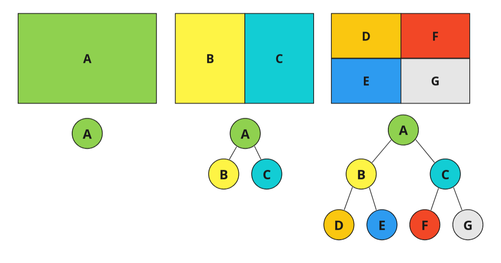
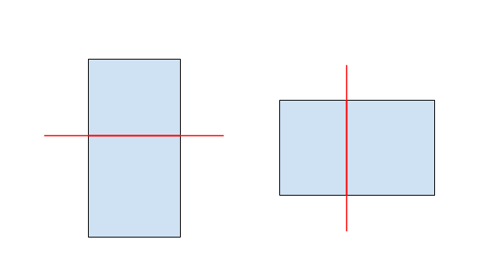
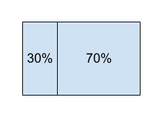
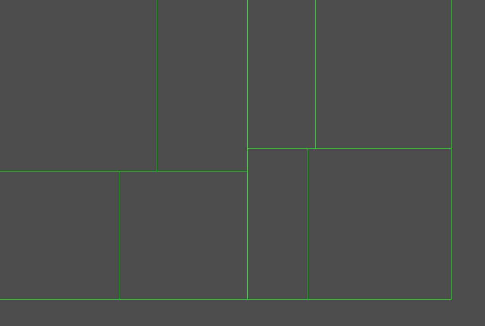
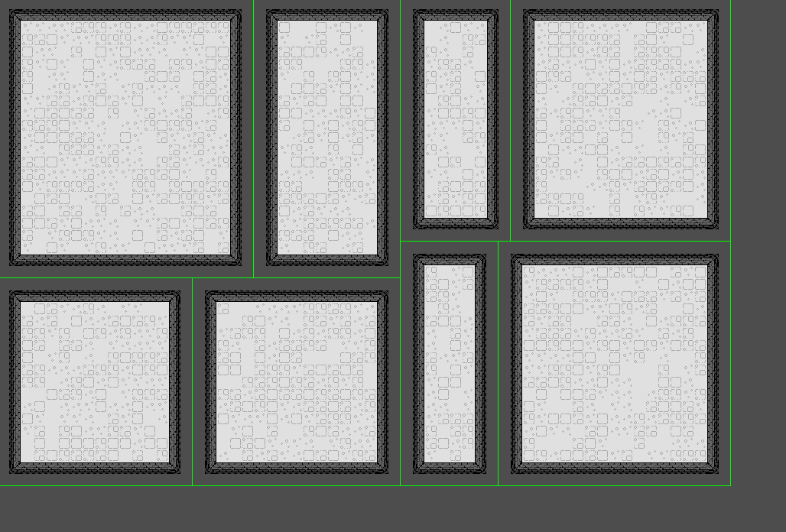
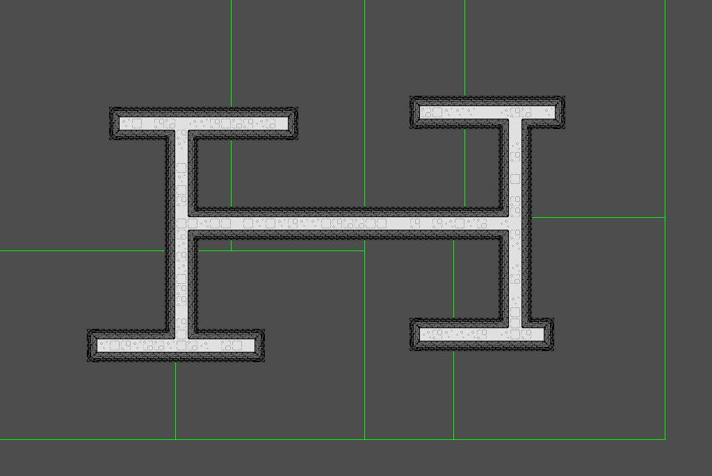
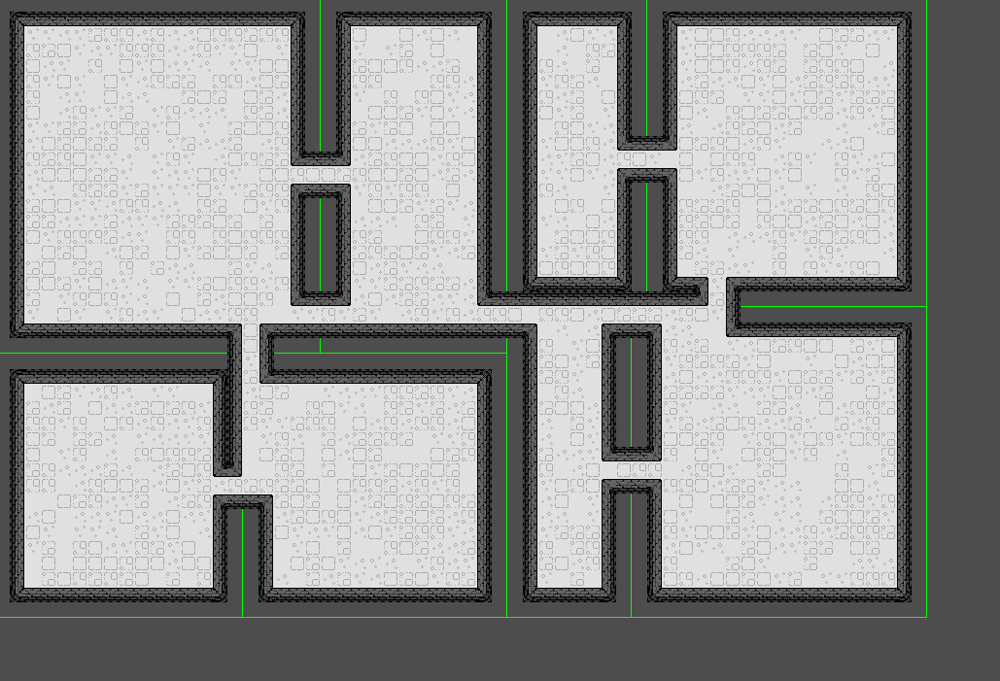

# Procedural Dungeon Generation

You can play around with it [here!](https://oats314.itch.io/procedural-dungeon-generation)

For my final project I made an interactive procedural dungeon generator, using a binary space partitioning algorithm to generate the rooms. Big thanks to Jono Shields for making [this tutorial](https://jonoshields.com/post/bsp-dungeon) that this project is based off of.

Binary space partitioning, or BSP, is an algorithm that recursively splits space in rooms, and stores these rooms in a tree. The leaves of the tree (nodes with no children) ultimately become the rooms of the dungeon.

In this implementation, rooms are always split along the longer dimension: tall rooms will be split horizontally, and wide rooms will be split vertically.

Additionally, rooms don’t always split such that the child rooms are equal sizes, they are randomized so they can be anywhere from 30% to 70% of the size of the parent.

Lastly, there is a minimum partition size limit to prevent a partition that is too small to generate a room in. If a split is attempted that results in a room smaller than this limit, the split will not occur and the node will stop attempting to split (even if there is a viable split at a different percentage).

After recursing for three splits (creating 8, $2^3$, rooms), the partitions look like this.

With the room partitioned, rooms are placed into the leaf partitions. There is a default padding of 1 tile to prevent rooms from touching.

Hallways are created by connecting the midpoint of each node with the midpoint of its sibling node.

When rooms and hallways are combined, the dungeon is complete!

